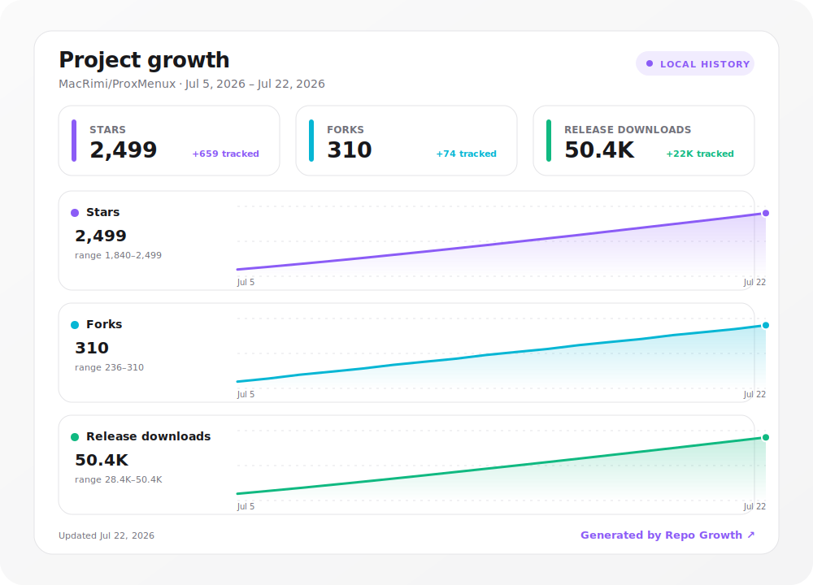
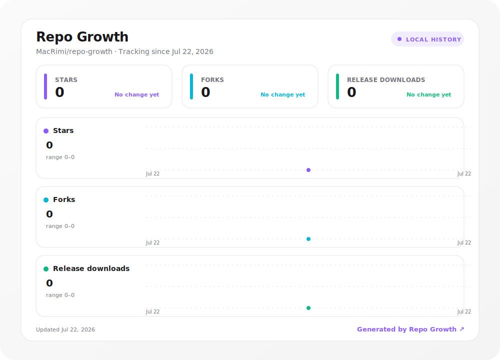

<h1 align="center">Repo Growth</h1>

<p align="center">
  <strong>A modern, self-contained growth dashboard for GitHub repositories.</strong>
</p>

<p align="center">
  Track stars, forks, and release downloads from your own repository.<br>
  No personal access token. No external service. No hosted database.
</p>

<p align="center">
  <a href="https://github.com/MacRimi/repo-growth/actions/workflows/test.yml"></a>
  &nbsp;
  <a href="LICENSE"></a>
</p>

<p align="center">
  <a href="#quick-start">Quick start</a> ·
  <a href="#how-it-works">How it works</a> ·
  <a href="#configuration">Configuration</a> ·
  <a href="#frequently-asked-questions">FAQ</a>
</p>

<p align="center">
  <a href="https://github.com/MacRimi/repo-growth">
    
  </a>
  <br>
  <sub>Preview generated with example data. The dashboard adapts automatically to GitHub's light and dark themes.</sub>
</p>

## At a glance

| | |
| --- | --- |
| **Zero secret setup** | Uses the short-lived `github.token` already provided to every workflow. |
| **Historical from day one** | Reconstructs currently available star and fork history on its first run. |
| **Repository-owned data** | The complete history remains a readable JSON file in your repository. |
| **Static and dependable** | Your README displays a local SVG, with no API request at viewing time. |
| **Honest download totals** | Previously observed downloads survive deleted or replaced release assets. |
| **Balanced visualization** | Each metric has its own chart, so different scales remain legible. |
| **Modern by default** | Responsive sizing, accessible labels, and automatic light/dark appearance. |

## Quick start

Create `.github/workflows/repo-growth.yml` in the repository you want to track:

```yaml
name: Update repository growth

on:
  schedule:
    - cron: "17 4 * * *"
  workflow_dispatch:

permissions:
  contents: write

concurrency:
  group: repo-growth
  cancel-in-progress: false

jobs:
  update:
    runs-on: ubuntu-latest
    steps:
      - uses: actions/checkout@v7
      - uses: MacRimi/repo-growth@v1
```

Run it once from the **Actions** tab. Repo Growth creates:

```text
assets/repo-growth.svg
.github/repo-growth/history.json
```

Add the dashboard to your README:

```html
<p align="center">
  <a href="https://github.com/MacRimi/repo-growth">
    
  </a>
</p>
```

That is all. The scheduled workflow records a new point each day and commits only when the generated content changes.

## How it works

```text
Scheduled GitHub Action
          │
          ▼
 GitHub REST API totals
   ├── Stars
   ├── Forks
   └── Release assets
          │
          ▼
 Persist history.json
          │
          ▼
 Generate adaptive SVG
          │
          ▼
 Commit changed files
```

On its first run, Repo Growth uses the repository-scoped `github.token` to read timestamped stars and fork creation dates. Later runs use aggregate counters to append one accurate snapshot per day.

> [!IMPORTANT]
> Existing stars and forks can be reconstructed, but deleted forks and removed stars are no longer present in GitHub's API. Release download history starts when Repo Growth is installed because GitHub does not expose timestamps for individual downloads.

## Why this approach?

GitHub restricted timestamped stargazer data in July 2026 to repository administrators and collaborators. Public services can no longer reconstruct a repository's star history anonymously.

Repo Growth runs as the repository's own workflow, so its short-lived automatic token has the necessary repository access without a personal token or stored secret. README visitors receive an already-generated image; there is no external API call, tracking request, or expiring URL in the rendering path.

## Configuration

| Input | Default | Description |
| --- | --- | --- |
| `repository` | Current repository | Repository in `owner/name` format |
| `output` | `assets/repo-growth.svg` | Generated dashboard path |
| `history` | `.github/repo-growth/history.json` | Persistent data path |
| `backfill` | `true` | Reconstruct existing star and fork history on the first run |
| `title` | `Project growth` | Heading displayed in the SVG |
| `metrics` | `stars,forks,downloads` | Metrics to display, in the desired order |
| `layout` | `dashboard` | Generate `dashboard`, `separate`, or `both` outputs |
| `commit` | `true` | Commit and push changed files |
| `commit-message` | `chore: update repository growth [skip ci]` | Automated commit message |
| `token` | `github.token` | Authentication token; no custom secret is normally needed |

For example:

```yaml
- uses: MacRimi/repo-growth@v1
  with:
    title: ProxMenux growth
    output: images/project-growth.svg
    metrics: stars,downloads
```

### Choose the metrics

Display any metric or combination by separating their names with commas:

```yaml
- uses: MacRimi/repo-growth@v1
  with:
    metrics: stars,downloads
```

The combined dashboard adapts its height and card widths automatically. One metric uses the full canvas; two metrics share the available space.

### Generate individual charts

Use `layout: separate` when each metric should have its own image:

```yaml
- uses: MacRimi/repo-growth@v1
  with:
    metrics: stars,forks,downloads
    layout: separate
    output: assets/repo-growth.svg
```

This creates:

```text
assets/repo-growth-stars.svg
assets/repo-growth-forks.svg
assets/repo-growth-downloads.svg
```

Use `layout: both` to generate the combined dashboard and the selected individual charts in the same run.

## Understanding download totals

“Downloads” means files explicitly attached to GitHub Releases. It does not include:

- Repository clones
- Automatically generated source ZIP or TAR archives
- Container pulls
- Package-manager installations
- Files hosted outside GitHub Releases

GitHub exposes the current count of each release asset, but not its historical daily totals. Repo Growth stores the last observed count for every asset and accumulates only positive changes. If an asset disappears, the downloads already observed remain in the total.

## Frequently asked questions

<details>
<summary><strong>Does it require a PAT or repository secret?</strong></summary>

No. The default `github.token` is enough to reconstruct available star and fork history, read repository totals and releases, and commit the generated files.
</details>

<details>
<summary><strong>Does the README call an external service?</strong></summary>

No. It displays the SVG committed to the same repository. Repo Growth is not involved when somebody views the README.
</details>

<details>
<summary><strong>What history can the first run reconstruct?</strong></summary>

Repo Growth reconstructs currently existing stars from their `starred_at` timestamps and forks from their creation dates. Removed stars and deleted forks cannot be recovered. Release download history begins with the first run because GitHub only exposes current asset totals.
</details>

<details>
<summary><strong>What happens if the workflow runs twice in one day?</strong></summary>

The existing point for that UTC date is updated. Duplicate daily entries are not created.
</details>

<details>
<summary><strong>Can I change the schedule?</strong></summary>

Yes. Change the cron expression in your workflow. Daily execution is the recommended balance between detail and commit frequency.
</details>

## Run locally

Node.js 20 or newer is required:

```bash
node bin/repo-growth.js \
  --repo MacRimi/ProxMenux \
  --history .github/repo-growth/history.json \
  --output assets/repo-growth.svg
```

Set `GITHUB_TOKEN` if the unauthenticated API rate limit is insufficient. Local execution never commits unless `--commit` is supplied.

## Development

Repo Growth has no runtime dependencies:

```bash
npm test
npm run demo
```

The GitHub Action uses Node.js 24. Generated SVGs contain no JavaScript, remote fonts, or external stylesheets.

## Contributing and security

Contributions are welcome. See [CONTRIBUTING.md](CONTRIBUTING.md) for the development workflow and pull request guidelines.

Please report vulnerabilities privately by following the process in [SECURITY.md](SECURITY.md).

## License

Repo Growth is available under the [MIT License](LICENSE).
